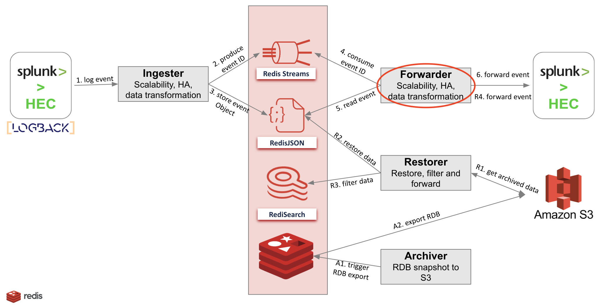

# Redis-Splunk Forwarder

The corner stone of our solution is Redis Enterprise. Redis Enterprise is a key-value on-memory database that offers automatic failover and replication to avoid data loss.
High and linear scalability to provide a tremendous throughput and a very low latency (sub milliseconds) when reading and writing data.
The solution consists of a Redis Enterprise cluster and several components (upstream and downstream of Redis Enterprise):

1. The ingester: following a publisher/subscriber architecture, this module listens to the Splunk agent (intercepts HTTP events) and produces data as JSON documents and put their ID in the `forward` Stream.
   To provide scalability, there can be several instances of the ingester behind a load-balancer (haproxy, nginx).
2. The forwarder : this module subscribes to the `forward` stream fed by the ingester module.
   For each received event, the forwarder gets the payload from the key and sends it to the Splunk HEC (Http Event Collector).
   If the payload is rejected for any reason, the forwarder stores the payload in the dead-letter queue for analysis and delivery retry.
3. The archiver: this module subscribes to the "event" stream and checks that “ingesters” and `forward` streams are empty. Then it triggers an hourly RDB backup to S3.
4. The restorer: on a “restore” message (from Admin API), this module restores one hourly RDB backup from S3 (JSON+Stream), it creates Redis Search indexes (FTSEARCH) and use them with provided filter criteria to UNLINK unwanted items (to keep only the required elements: by user, by host and by Splunk index)

This repository is a lightweight implementation of the Forwarder module.



## Usage
Clone the Repository:
```bash
git clone https://github.com/amineelkouhen/redis-splunk-forwarder.git
```

There is a docker compose script which will bootstrap all the components required to make this demo work.

1. Build the project `./gradlew build`
2. Run `docker-compose up` from the root dir
2. The containers will start in the correct order
3. On startup:
- The Splunk Service will bootstrap `Splunk Enterprise`. After the container starts up successfully and enters the "healthy" state, you should be able to access SplunkWeb at [http://localhost:8000](http://localhost:8000) with admin:Admin12345.
- The Forwarder Service will bootstrap the Splunk-Redis Forwarder Module that listens to the `forward` stream and consume events.

```bash
Creating splunk-service ... done
Creating forwarder-service ... done
Attaching to splunk-service, forwarder-service
forwarder-service | [main] c.r.s.f.configuration.JedisConfig        : host redis - port 6379
forwarder-service | [main] c.r.s.f.consumer.service.ConsumeService  : consuming object with ID 5f5fffee-3ed2-4b66-98ed-b596ef9f3a4e
```
- The Forwarder Module will re-create a Rest Request based on data received in the `forward` stream (and the headers embded on events) and will re-send the event to the HttpEventCollector (HEC) of Splunk.
```bash
forwarder-service | [main] c.r.s.f.proxy.service.HECProxyService    : <200,{"text":"Success","code":0},[Date:"Tue, 22 Nov 2022 21:23:16 GMT", Content-Type:"application/json; charset=UTF-8", X-Content-Type-Options:"nosniff", Content-Length:"27", Vary:"Authorization", Connection:"Keep-Alive", X-Frame-Options:"SAMEORIGIN", Server:"Splunkd"]>
```
### Software Reqs
- Docker
- Docker Compose
- Java 11+
